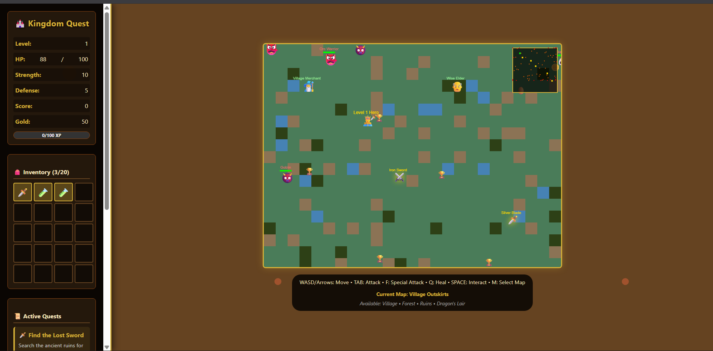
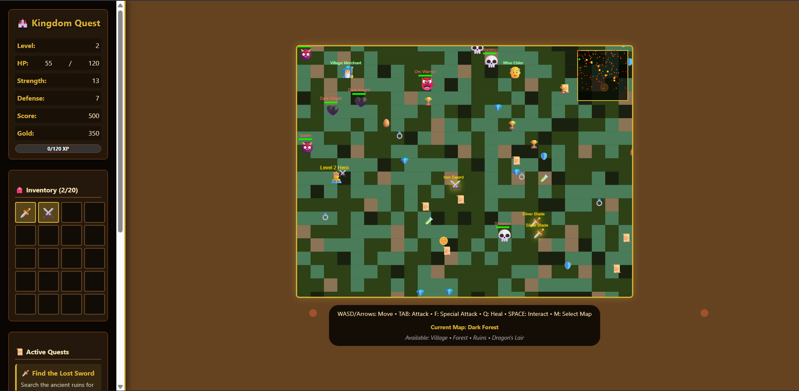

# **Medieval RPG - Kingdom Quest** ⚔️

## **Description 📃**

**Medieval RPG - Kingdom Quest** is a complete 2D action RPG game built with HTML5 Canvas, CSS3, and JavaScript. Experience an immersive medieval fantasy world with combat, automatic inventory management, and progressive character development.

## **Functionalities 🎮**

-   **🗺️ Multi-Map World System**: 4 explorable areas (Village Outskirts, Dark Forest, Ancient Ruins, Dragon's Lair)
-   **⚔️ Keyboard Combat System**: Pure keyboard-based combat with automatic targeting
-   **🎒 Automatic Inventory**: Items are automatically collected when walking over them
-   **🗡️ Progressive Weapon System**: 5 swords from Rusty to Legendary with increasing power
-   **✨ Attack Animations**: Particle effects, damage numbers, and critical hit animations
-   **📜 Dynamic Quest System**: Progressive quests with completion rewards
-   ** Portal Travel**: Fast travel between different map areas

## **How to play? 🕹️**

### **Controls:**

-   **W A S D / Arrow Keys**: Move your character
-   **TAB**: Attack nearby enemies
-   **F**: Use equipped weapon's special attack
-   **Q**: Quick heal using available potions
-   **SPACE**: Interact with NPCs and shops
-   **M**: Open map selection to travel between areas
-   **ESC**: Close any open modals

### **Gameplay:**

-   **Village Outskirts** (⭐): Starting area with basic enemies
-   **Dark Forest** (⭐⭐): Tougher enemies and enhanced weapons
-   **Ancient Ruins** (⭐⭐⭐): Rare artifacts and challenging combat
-   **Dragon's Lair** (⭐⭐⭐⭐⭐): End-game content with legendary equipment

## **Screenshots 📸**

